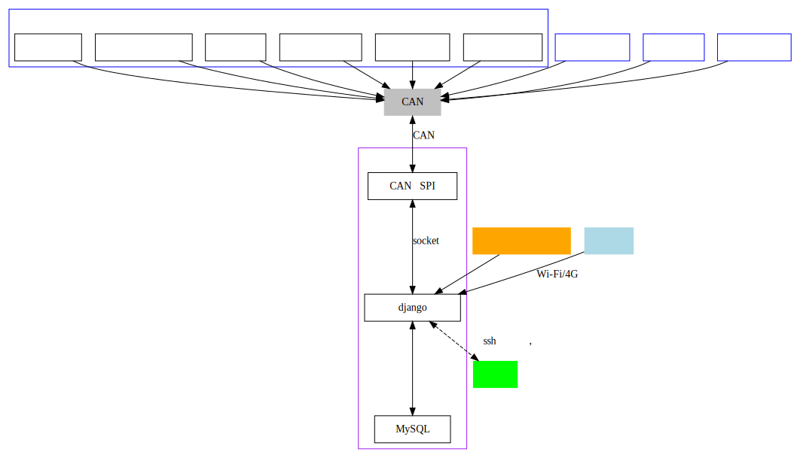
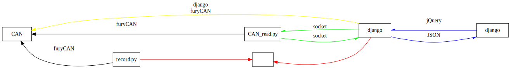

# furyTerminal文档

目录

---
1. [简介](#简介)
   1. [文档目的](#文档目的)
   2. [发起时间](#发起时间)
   3. [规划](#规划)
      1. [TODO](#TODO)
      2. [FIXME](#FIXME)
      3. [Milestone](#Milestone)
   4. [系统目标](#系统目标)
   5. [系统环境](#系统环境)
2. [CAN转SPI模块](#CAN转SPI模块)
3. [DSI接口的7寸触摸显示屏](#DSI接口的7寸触摸显示屏)
4. [测试](#测试)
5. [树莓派配置](#树莓派配置)
   1. [网络配置](#网络配置)
6. [车载网站 (交互平台)](#车载网站-交互平台)
   1. [文件树](#文件树)
   2. [站点地图](#站点地图)
   3. [数据流方案](#数据流方案)
   4. [如此选择的优缺点](#如此选择的优缺点)
      1. [Django](#Django)
         1. [优点](#优点)
         2. [缺点](#缺点)
      2. [SQLite3](#SQLite3)
         1. [优点](#优点-1)
         2. [缺点](#缺点-1)
      3. [MySQL](#MySQL)
         1. [优点](#优点-2)
         2. [缺点](#缺点-2)
         3. [MySQL命令简记](#MySQL命令简记)
   5. [管理](#管理)
   6. [oncar](#oncar)
      1. [oncar设计](#oncar设计)
   7. [django纪要](#django纪要)
      1. [设置允许访问的地址](#设置允许访问的地址)
      2. [设置后台时间显示格式](#设置后台时间显示格式)
      3. [设置字段不可修改](#设置字段不可修改)
      4. [模板](#模板)
      5. [常用命令](#常用命令)
         1. [运行网站](#运行网站)
         2. [生成应用的迁移](#生成应用的迁移)
         3. [应用迁移到网站](#应用迁移到网站)
         4. [database API](#database-API)
            1. [进入专用python解释器](#进入专用python解释器)
            2. [添加记录](#添加记录)
      6. [注意事项](#注意事项)
   8. [页面设计纪要](#页面设计纪要)
      1. [仪表盘](#仪表盘)
---

## 简介

### 文档目的

本文档是furyTerminal系统总体和各部分说明, 主要面向电气组开发人员, 其他组成员不应需要阅读
本文档, 系统实现的应当是十分友好 (傻瓜式) 的交互😁

### 发起时间

2019-02-01

### 规划

#### TODO

- 传感器调试, 安全回路状态界面
  - 油门深度 (单色直柱)
  - 刹车深度 (单色直柱)
  - 安全电路状态图与flag数值的对应
- 车手界面电控报警信息提示 alert (可考虑通过浏览器级刷新页面来消除alert)
- 电池箱温度热力图
- G加速度圆

#### FIXME

- 数据传输延迟. 可能是将是从CAN里读取数据更新到state中因为刷新率不同有延迟, 可能是将state里数据传输到后端的socket的缓冲区设置不合理有延迟, 另外前端页面刷新数据有几十毫秒的延迟. 也可能是其他原因.
- 开机后Plymouth结束到开始加载桌面不知为何有大约8s的黑屏. 尽量缩短界面加载时间.

#### Milestone

- 为每个车手建立账号分别记录数据
- 将每次跑动的时间, 速率, 方向, 油门, 刹车, 电量等关联起来, 达到还原整次跑动的效果, 方便实时/后期的分析
- 语音提示, 蓝牙连接车手耳麦

### 系统目标

命名为furyTerminal是因为本系统的目标是做出一个 **友好, 直观, 健壮** 的赛车
终端:

- 让操作方式足够友好, 车队队员们能通过简单操作来获取数据或者更改参数
- 数据呈现方式, 交互方式足够直观, 速度, 油门, 时间等车手常用数据明显, 故障原因提示内容足够直观, 分析用数据以图表形式呈现
- 系统足够健壮, 能够应对绝大多数故障情况, 比如掉电数据储存等.

至于什么是终端 (Terminal), 参见 🔗 [这里](https://www.zhihu.com/question/21711307/answer/118788917)



### 系统环境

`python` version: Python 3.7.3 (default, Apr  3 2019, 05:39:12) [GCC 8.2.0] on linux

💡 当前系统默认python为 3.7.3, 若想将系统默认python切换回python2, 运行以下命令然后跟随指导操作.

```shell
sudo update-alternatives --config python
```

⚠️需注意pip的版本与python版本相匹配, 通过运行 `pip -V` 来查看pip版本和位置

`django` version: 2.2.7

## CAN转SPI模块

📑 [RS485 CAN HAT用户手册](doc/CAN2SPI/CAN_to_SPI_module/RS485-CAN-HAT-user-manual-cn.pdf)

📑 [RS485 CAN HAT电路图](doc/CAN2SPI/CAN_to_SPI_module/RS485_CAN_HAT_Schematic.pdf)

🔗 [python-can文档](https://python-can.readthedocs.io/en/master/index.html#)

## DSI接口的7寸触摸显示屏

📑 [7寸触摸屏说明书](doc/display/7寸触摸屏说明书.md)

## 测试

位于`/test`文件夹下的为各部分测试程序


## 树莓派配置

### 网络配置

TODO

## 车载网站 (交互平台)

之所以选择做网站是因为网站是最容易实现的GUI, 也能很轻松地接入大量库, 轻松实现远程访问等功能.

只要开机自启浏览器全屏模式, 用代码避免误触露出端倪, 根本看不出是网页!🎉

防止误触露出端倪具体来说指**隐藏鼠标图标**, **禁用右键菜单**, **禁止选中**等

🔗 [防止误触相关代码](https://blog.csdn.net/jx950915/article/details/80346530)

本网站基于 **Django** 框架和MySQL数据库.

### 文件树

.  
├── config 用于快速部署环境的配置文件.  
├── doc 项目相关的文档  
├── furyCAN CAN总线数据读取模块  
├── furyTerminal django网站基础目录  
├── log 网站运行日志  
├── oncar 网站**oncar**段后端  
├── scripts 几个相关脚本  
├── static 网站用到的静态文件  
├── templates 网站静态页面模板  
└── test 几个测试用脚本  

### 站点地图

- `/` (Home Page)
  - `/oncar`
    - `/` (车手页面)
    - `/devices` (赛前设备状态检查页)
    - `/refresh` (不是访问页面, 是给车手页面刷新数据的)
  - `/remote`

### 数据流方案

目前项目的难点在于如何**实时**从CAN总线传输数据到前端, 也就是数据流的方案.

💡 目前项目有4个分支: `master`, `sqlite_ver`, `mysql_ver`, `databaseless`. 其中`master`分支暂时停留在某一版本的`mysql_ver`提交, 待确定数据传输方案再合并到`master`.

👇数据流方案示意图



其中彩色线部分是可能产生延迟的地方. 红色部分经实验**目前的数据规模下**几乎无延迟. 绿色和黄色部分因为是以**一定频率**发生, 怀疑因为**缓冲区大小**设置不合理因此存在延迟. 蓝色部分经试验会产生大致30ms延迟 (可能是django架构拖了后腿).

- `sqlite_ver`是以sqlite作为数据库, 储存数据的版本. 原本利用SQLite3数据库传输数据,  问题在于sqlite是个轻量级数据库, **无法支持高并发**, 当有多于一个终端访问网站时向数据库写入新数据的程序会遭遇进程锁而结束. 这个问题以数据库**只用来储存数据, 不被前端实时访问**而解决. 在这个版本中**后端直接调用furyCAN模块**获取数据.
- `mysql_ver`是在遇到上述问题后尝试的解决方式之一, **以MySQL数据库记录, 传输数据**. MySQL的强大性能使得高并发导致程序终止问题不复存在, 但MySQL的事务隔离等级的选择值得再研究一下. 这可能是最后会使用的方案.
- `databaseless`是**不断从CAN总线读取数据并通过socket与后端通信**的解决方案. ❗️实际上我没能理清这样的方式传递到前端的数据流是否还是按照正确的时间先后顺序排列的. 我想这种方案应当被放弃, 因为它似乎并没有什么好处. 💡 后续工作可以是用ROS的通信系统代替手搓socket, 数据流会健壮许多.

🚩 总而言之, 为了储存数据一个数据库是必要的. (存入简单的文件比如csv文件并不会是一个好选择, 以数据库的形式更便于管理数据, 与django协作更方便) 但使用数据库的方式需要进一步探索: 是单纯储存实时性没那么强的数据以供平时分析? 还是近乎实时记录数据 (经测试即便数据记录频率很高数据库体积相对于SD卡空间也很小), 利用数据库在Python文件间传递数据?

⚠️ 最头疼的是延迟到底是何处产生的呀😭 目前的延迟大致是3s (我已经尽力了)

### 如此选择的优缺点

#### Django

##### 优点

- 是一个python框架, 数据处理很方便, 容易接入ROS
- 容易上手. 个人认为结合了前后端, 更偏向后端, 但前端能很容易的结合前端

##### 缺点

速度不算快

#### SQLite3

##### 优点

- SQLite3是一个轻量级数据库, 是Django默认使用的数据库, 不需要什么额外操作竟可以轻松部署一个SQLite3数据库, 很方便移植.
- 对SQLite3数据库操作也很简单, 几乎全部操作都可以用django提供的api命令完成. 学习起来也相对简单, 因为本身就没那么多高级功能.
- SQLite3数据库就是一个在指定目录的`.sqlite3`结尾的文件, 很方便管理

##### 缺点

- 它的缺点同样很明显, 轻量级使SQLite3不支持高并发, 如果高并发就会产生进程锁.

#### MySQL

一开始使用的是SQLite, 但是[SQLite不支持高并发访问](https://blog.csdn.net/u013690521/article/details/38776709),
因此改用MySQL.

##### 优点

支持高并发, 有更丰富的功能

##### 缺点

- 部署起来要麻烦一些, 需要单独创建这个数据库
- 操作复杂一点. 可设置参数更多实际上对不了解的人来说很不友好, 会让人迷茫该选哪个.

##### MySQL命令简记

💡 root用户初始密码为空, 只能`su`到root用户进入mysql

命令行进入mysql `mysql -u fury -p`

新建数据库 `create database furyTerminal character set utf8;`  
删除数据库 `drop database furyTerminal;`  
查看数据库中的数据表 `use furyTerminal; show tables;`  
新建用户 `create user fury identified by 'fury';`  
给予用户权限 `grant all privileges on furyTerminal.* to fury;`  
查看用户权限 `show grants for fury;`  
查看所有用户 `select user, host from mysql.user;`

👇一些推荐的学习资料

🔗 [HTML教程](https://www.w3schools.com/html/default.asp)  
🔗 [CSS教程](https://www.w3schools.com/css/default.asp)  
🔗 [Bootstrap教程](https://www.w3schools.com/bootstrap4/default.asp)  
🔗 [Bootstrap官方文档](https://getbootstrap.com/docs/4.3/getting-started/introduction/)  
🔗 [JavaScript教程](https://www.w3schools.com/js/default.asp)  
🔗 [Django官方文档中文版](https://docs.djangoproject.com/zh-hans/2.1/) (翻译不全)  
🔗 [Django**2.2**文档个人中文翻译](http://www.liujiangblog.com/course/django/2)  
🔗 [Django MySQL数据库文档](https://docs.djangoproject.com/en/2.2/ref/databases/#time-zone-definitions)

### 管理

管理员账号: leo

密码: leo

💡 添加管理员 `python manage.py createsuperuser`

💡 对于SQLite3数据库来说, 如果把数据库文件 (`sqlite3`结尾的文件) 删掉了的话原本的管理员信息同时也被删掉了.

### oncar

#### oncar设计

📝 [oncar面板设计草稿](doc/furyTerminal/oncar/面板设计草稿.md)

### django纪要

#### 设置允许访问的地址

在 `furyTerminal/furyTerminal/settings.py` 中 **ALLOWED_HOSTS**一项设置了允许访问
网站的地址, 设为 `'*'` 则是允许所有地址访问.

#### 设置后台时间显示格式

🔗 [可用的格式化字符](https://docs.djangoproject.com/en/2.0/ref/templates/builtins/#date)
🔗 具体参考[这里](https://blog.51cto.com/xujpxm/2090382)

#### 设置字段不可修改

在对应的父类为 **admin.ModelAdmin** 的类下重写 `get_readonly_fields`方法如下:

```python
def get_readonly_fields(self, request, obj=None):
    if obj:  # obj is not None, so this is an edit
        return ['[readonly_fields]']  # Return a list or tuple of readonly fields' names
    else:  # This is an addition
        return []
```

#### 模板

🔗 参考链接:
- [模板的导入和继承, 静态文件的使用](https://blog.csdn.net/qq_33961117/article/details/83993039)
- [Django2.2文档翻译-模板层](http://www.liujiangblog.com/course/django/145)

🔗 [参考](https://stackoverflow.com/questions/7860612/django-admin-make-field-editable-in-add-but-not-edit)

#### 常用命令

💡 因为我记性很差, 将常用命令集成到了根目录下的python脚本`fury`

##### 运行网站

⚠️ 在网站根目录执行.
💡此时为网站在 **localhost:8000** 运行

```shell
python furyTerminal/manage.py runserver 0:8000
```

##### 生成应用的迁移

```shell
python manage.py makemigrations
```

##### 应用迁移到网站

⚠️ 在网站根目录执行.

```shell
python manage.py migrate
```

##### database API

###### 进入专用python解释器

> 我们使用这个命令而不是简单的使用 "Python" 是因为 **manage.py** 会设置
> **DJANGO_SETTINGS_MODULE** 环境变量，这个变量会让 Django 根据 **mysite/settings.py**
> 文件来设置 Python 包的导入路径。

```shell
python manage.py shell
```

💡如果想通过脚本调用 database API, 需要在脚本开头加上以下语句:

```python
from furyTerminal import settings
os.environ.setdefault('DJANGO_SETTINGS_MODULE', 'furyTerminal.settings')
django.setup()
```

具体例子参见[oncar应用的Speed部分的测试](test/oncar/speed-gauge/create.py)

###### 添加记录

举例: 向 **oncar** 应用的 **Speed** 模型添加记录

1.首先当然是引用它

```python
from oncar.models import Speed
```

2.有两种添加方法:

   1. 先实例化然后保存 🔗[save()](https://docs.djangoproject.com/zh-hans/2.1/topics/db/queries/)

      ```python
      speeed = Speed(speed_value='123')
      speeed.save()
      ```

   2. 直接创建 🔗[creat()](https://docs.djangoproject.com/zh-hans/2.1/ref/models/querysets/#django.db.models.query.QuerySet.create)

      ```python
      Speed.objects.create(speed_value='123')
      ```

#### 注意事项

- path()函数的参数`route`不会匹配 GET 和 POST 参数或域名。例如，URLconf 在处理请求
  https://www.example.com/myapp/ 时，它会尝试匹配 myapp/ 。处理请求
  https://www.example.com/myapp/?page=3 时，也只会尝试匹配 myapp/。
- 🔗[django模型中auto_now和auto_now_add的区别](https://www.cnblogs.com/vincenshen/articles/7659763.html)

### 页面设计纪要

#### 仪表盘

最开始自己手搓的仪表盘显得有些卡顿, 能达到0.5秒级刷新, 再快很容易让chrome崩溃. 这个刷新率听起来不低, 0.5s的延迟在汽车上不算高, 但呈现出来的**变化过程不够平滑**, 给人一种卡顿感.

🔗 [这个](https://www.codewall.co.uk/creating-gauge-charts-with-the-justgage-javascript-library/)是一个最简陋的有平滑移动的仪表盘的教程

🔗 [这个](https://www.pubnub.com/blog/streaming-sensor-readings-realtime-gauge-chart/)是一个用树莓派读取传感器参数并显示在网页仪表盘的实例

🔗 [这个](https://developers.google.com/chart/interactive/docs/gallery/gauge)是Google Charts的**朴素派**仪表 (效果如下图)


🔗 [这个](https://www.cssscript.com/canvas-based-html5-gauge-library-gauge-js/)是目前找到最符合赛车样式的仪表 (好吧梁师傅说没有科技感), 由**canvas**绘制. 刷新值代码:

```js
document.gauges[0].value = current_speed;
```


🔗 [这个](https://www.cssscript.com/animated-svg-gauge/)是科技简约风的, 由**svg**绘制, 刷新值代码:

```js
speedGauge.setValue(10)
```

