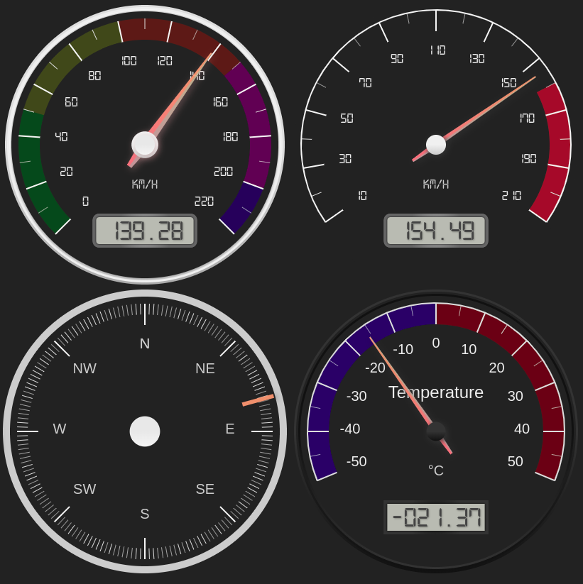

# furyTerminal文档

目录

---
1. [简介](#%E7%AE%80%E4%BB%8B)
   1. [文档目的](#%E6%96%87%E6%A1%A3%E7%9B%AE%E7%9A%84)
   2. [发起时间](#%E5%8F%91%E8%B5%B7%E6%97%B6%E9%97%B4)
   3. [规划](#%E8%A7%84%E5%88%92)
      1. [TODO](#TODO)
      2. [FIXME](#FIXME)
      3. [Milestone](#Milestone)
   4. [系统目标](#%E7%B3%BB%E7%BB%9F%E7%9B%AE%E6%A0%87)
   5. [系统环境](#%E7%B3%BB%E7%BB%9F%E7%8E%AF%E5%A2%83)
2. [CAN转SPI模块](#CAN%E8%BD%ACSPI%E6%A8%A1%E5%9D%97)
3. [DSI接口的7寸触摸显示屏](#DSI%E6%8E%A5%E5%8F%A3%E7%9A%847%E5%AF%B8%E8%A7%A6%E6%91%B8%E6%98%BE%E7%A4%BA%E5%B1%8F)
4. [车载网站 (交互平台)](#%E8%BD%A6%E8%BD%BD%E7%BD%91%E7%AB%99-%E4%BA%A4%E4%BA%92%E5%B9%B3%E5%8F%B0)
   1. [如此选择的优缺点](#%E5%A6%82%E6%AD%A4%E9%80%89%E6%8B%A9%E7%9A%84%E4%BC%98%E7%BC%BA%E7%82%B9)
      1. [Django](#Django)
         1. [优点](#%E4%BC%98%E7%82%B9)
         2. [缺点](#%E7%BC%BA%E7%82%B9)
      2. [Bootstrap](#Bootstrap)
         1. [优点](#%E4%BC%98%E7%82%B9-1)
         2. [缺点](#%E7%BC%BA%E7%82%B9-1)
   2. [管理](#%E7%AE%A1%E7%90%86)
   3. [oncar](#oncar)
      1. [oncar设计](#oncar%E8%AE%BE%E8%AE%A1)
   4. [django纪要](#django%E7%BA%AA%E8%A6%81)
      1. [设置允许访问的地址](#%E8%AE%BE%E7%BD%AE%E5%85%81%E8%AE%B8%E8%AE%BF%E9%97%AE%E7%9A%84%E5%9C%B0%E5%9D%80)
      2. [设置后台时间显示格式](#%E8%AE%BE%E7%BD%AE%E5%90%8E%E5%8F%B0%E6%97%B6%E9%97%B4%E6%98%BE%E7%A4%BA%E6%A0%BC%E5%BC%8F)
      3. [设置字段不可修改](#%E8%AE%BE%E7%BD%AE%E5%AD%97%E6%AE%B5%E4%B8%8D%E5%8F%AF%E4%BF%AE%E6%94%B9)
      4. [模板](#%E6%A8%A1%E6%9D%BF)
      5. [常用命令](#%E5%B8%B8%E7%94%A8%E5%91%BD%E4%BB%A4)
         1. [运行网站](#%E8%BF%90%E8%A1%8C%E7%BD%91%E7%AB%99)
         2. [生成应用的迁移](#%E7%94%9F%E6%88%90%E5%BA%94%E7%94%A8%E7%9A%84%E8%BF%81%E7%A7%BB)
         3. [应用迁移到网站](#%E5%BA%94%E7%94%A8%E8%BF%81%E7%A7%BB%E5%88%B0%E7%BD%91%E7%AB%99)
         4. [database API](#database-API)
            1. [进入专用python解释器](#%E8%BF%9B%E5%85%A5%E4%B8%93%E7%94%A8python%E8%A7%A3%E9%87%8A%E5%99%A8)
            2. [添加记录](#%E6%B7%BB%E5%8A%A0%E8%AE%B0%E5%BD%95)
      6. [注意事项](#%E6%B3%A8%E6%84%8F%E4%BA%8B%E9%A1%B9)
   5. [页面设计纪要](#%E9%A1%B5%E9%9D%A2%E8%AE%BE%E8%AE%A1%E7%BA%AA%E8%A6%81)
      1. [仪表盘](#%E4%BB%AA%E8%A1%A8%E7%9B%98)
---

## 简介

### 文档目的

本文档是furyTerminal系统总体和各部分说明, 主要面向电气组开发人员, 其他组成员不应需要阅读
本文档, 系统实现的应当是十分友好 (傻瓜式) 的交互😁

### 发起时间

2019-02-01

### 规划

#### TODO

- 开机动画. 可参考 🔗[YouTube上一个人给树莓派换Spalsh Screen](https://www.youtube.com/watch?v=VK_eBe53Stc)
- 添加 oncar 界面的内容, 详情参见[oncar面板设计草稿](doc/furyTerminal/oncar/面板设计草稿.md)
- 禁止右键菜单. 可参考 🔗[这个百度知道](https://jingyan.baidu.com/article/ed2a5d1fac6f6c09f6be179b.html)
- 树莓派开机自启指定网页. 可参考 🔗[这里](https://blog.csdn.net/szu_Vegetable_Bird/article/details/80231660)
- 写一个函数来解析CAN总线里读出的数据

#### FIXME

- oncar界面部分数据 (车速, 油门等) 刷新不及时, 暂时有以下两种解决思路:
  - 怀疑是后端数据库更新数据太频繁导致前端请求速度过慢, 考虑不从数据库请求数据, 即, 先将传感器
    读到的数据发送给model, 这样model不需要从后端读取数据, 另一方面后端记录的数据密度也许不需要这么大
- 考虑使用websocket
- 监听一个端口不知道可不可以
参考 🔗
- [后端主动向前段推送消息的几种方式（转）](https://blog.csdn.net/justyou_and_me/article/details/88218199)
- [知乎-服务端是如何主动推送信息到客户端的？](https://www.zhihu.com/question/24938934)
- [服务器有新消息主动推送给客户端浏览器](https://blog.csdn.net/qq_35448976/article/details/78783698)

#### Milestone

- 为每个车手建立账号分别记录数据
- 将每次跑动的时间, 速率, 方向, 油门, 刹车, 电量等关联起来, 达到还原整次跑动的效果, 方便实时/
  后期的分析
- 语音提示

### 系统目标

命名为furyTerminal是因为本系统的目标是做出一个 **友好, 直观, 健壮** 的赛车
终端:

- 让操作方式足够友好, 车队队员们能通过简单操作来获取数据或者更改参数
- 数据呈现方式, 交互方式足够直观, 速度, 油门, 时间等车手常用数据明显, 故障原因提示内容足够直观, 分析用数据以图表形式呈现
- 系统足够健壮, 能够应对绝大多数故障情况, 比如掉电数据储存等.

至于什么是终端 (Terminal), 参见 🔗 [这里](https://www.zhihu.com/question/21711307/answer/118788917)


### 系统环境

`Linux` version: 4.14.34-v7+ (dc4@dc4-XPS13-9333) (gcc version 4.9.3 (crosstool-NG crosstool-ng-1.22.0-88-g8460611)) #1110 SMP Mon Apr 16 15:18:51 BST 2018

`Raspbian` version: Raspbian GNU/Linux 9.6 (stretch)

❗️ 当前使用[中科大源](https://lug.ustc.edu.cn/wiki/mirrors/help/raspbian)

`python` version: Python 3.5.3 (default, Sep 27 2018, 17:25:39) [GCC 6.3.0 20170516] on linux

💡 当前系统默认python为 3.5.3, 若想将系统默认python切换回python2, 运行以下命令然后跟随指导操作.

```shell
sudo update-alternatives --config python
```

⚠️需注意pip的版本与python版本相匹配, 通过运行 `pip -V` 来查看pip版本和位置

`django` version: 2.1.7

## CAN转SPI模块

📑 [RS485 CAN HAT用户手册](doc/CAN2SPI/CAN_to_SPI_module/RS485-CAN-HAT-user-manual-cn.pdf)

📑 [RS485 CAN HAT电路图](doc/CAN2SPI/CAN_to_SPI_module/RS485_CAN_HAT_Schematic.pdf)

🔗 [python-can文档](https://python-can.readthedocs.io/en/master/index.html#)

## DSI接口的7寸触摸显示屏

📑 [7寸触摸屏说明书](doc/display/7寸触摸屏说明书.md)

## 车载网站 (交互平台)

本网站基于 **Django** 框架和 **Bootsrap** 框架.

### 如此选择的优缺点

#### Django

##### 优点

- 是一个python框架, 数据处理很方便.
- 容易上手. 个人认为结合了前后端, 更偏向后端, 但前端能很容易的结合前端

##### 缺点

暂时不知道

#### Bootstrap

##### 优点

- 容易上手😅是的不好意思我太菜了
- 使用容易. 只要在 HTML 页面中插入 Bootstrap 官网给出的模板即可.
- 被广泛使用, 简洁好看

##### 缺点

- 被一些做前端的程序员认为不能够作出很炫技的效果, 是后端开发者用的东西.

👇一些推荐的学习资料

🔗 [HTML教程](https://www.w3schools.com/html/default.asp)  
🔗 [CSS教程](https://www.w3schools.com/css/default.asp)  
🔗 [Bootstrap教程](https://www.w3schools.com/bootstrap4/default.asp)  
🔗 [Bootstrap官方文档](https://getbootstrap.com/docs/4.3/getting-started/introduction/)  
🔗 [JavaScript教程](https://www.w3schools.com/js/default.asp)  
🔗 [Django官方文档中文版](https://docs.djangoproject.com/zh-hans/2.1/) (翻译不全)  
🔗 [Django**2.2**文档个人中文翻译](http://www.liujiangblog.com/course/django/2)

### 管理

管理员账号: leo

密码: 111111

### oncar

#### oncar设计

📝 [oncar面板设计草稿](doc/furyTerminal/oncar/面板设计草稿.md)

### django纪要

#### 设置允许访问的地址

在 `furyTerminal/furyTerminal/settings.py` 中 **ALLOWED_HOSTS**一项设置了允许访问
网站的地址, 设为 `'*'` 则是允许所有地址访问.

#### 设置后台时间显示格式

🔗 [可用的格式化字符](https://docs.djangoproject.com/en/2.0/ref/templates/builtins/#date)
🔗 具体参考[这里](https://blog.51cto.com/xujpxm/2090382)

#### 设置字段不可修改

在对应的父类为 **admin.ModelAdmin** 的类下重写 `get_readonly_fields`方法如下:

```python
def get_readonly_fields(self, request, obj=None):
    if obj:  # obj is not None, so this is an edit
        return ['[readonly_fields]']  # Return a list or tuple of readonly fields' names
    else:  # This is an addition
        return []
```

#### 模板

🔗 参考链接:
- [模板的导入和继承, 静态文件的使用](https://blog.csdn.net/qq_33961117/article/details/83993039)
- [Django2.2文档翻译-模板层](http://www.liujiangblog.com/course/django/145)

🔗 [参考](https://stackoverflow.com/questions/7860612/django-admin-make-field-editable-in-add-but-not-edit)

#### 常用命令

💡 因为我记性很差, 将常用命令集成到了根目录下的python脚本`fury`

##### 运行网站

⚠️ 在网站根目录执行.
💡此时为网站在 **localhost:8000** 运行

```shell
python furyTerminal/manage.py runserver 0:8000
```

##### 生成应用的迁移

```shell
python manage.py makemigrations
```

##### 应用迁移到网站

⚠️ 在网站根目录执行.

```shell
python manage.py migrate
```

##### database API

###### 进入专用python解释器

> 我们使用这个命令而不是简单的使用 "Python" 是因为 **manage.py** 会设置
> **DJANGO_SETTINGS_MODULE** 环境变量，这个变量会让 Django 根据 **mysite/settings.py**
> 文件来设置 Python 包的导入路径。

```shell
python manage.py shell
```

💡如果想通过脚本调用 database API, 需要在脚本开头加上以下语句:

```python
from furyTerminal import settings
os.environ.setdefault('DJANGO_SETTINGS_MODULE', 'furyTerminal.settings')
django.setup()
```

具体例子参见[oncar应用的Speed部分的测试](/oncar/test/speed/create.py)

###### 添加记录

举例: 向 **oncar** 应用的 **Speed** 模型添加记录

1.首先当然是引用它

```python
from oncar.models import Speed
```

2.有两种添加方法:

   1. 先实例化然后保存 🔗[save()](https://docs.djangoproject.com/zh-hans/2.1/topics/db/queries/)

      ```python
      speeed = Speed(speed_value='123')
      speeed.save()
      ```

   2. 直接创建 🔗[creat()](https://docs.djangoproject.com/zh-hans/2.1/ref/models/querysets/#django.db.models.query.QuerySet.create)

      ```python
      Speed.objects.create(speed_value='123')
      ```

#### 注意事项

- path()函数的参数`route`不会匹配 GET 和 POST 参数或域名。例如，URLconf 在处理请求
  https://www.example.com/myapp/ 时，它会尝试匹配 myapp/ 。处理请求
  https://www.example.com/myapp/?page=3 时，也只会尝试匹配 myapp/。
- 🔗[django模型中auto_now和auto_now_add的区别](https://www.cnblogs.com/vincenshen/articles/7659763.html)

### 页面设计纪要

#### 仪表盘

最开始自己手搓的仪表盘显得有些卡顿, 能达到0.5秒级刷新, 再快很容易让chrome崩溃. 这个刷新率听起来不低, 0.5s的延迟在汽车上不算高, 但呈现出来的**变化过程不够平滑**, 给人一种卡顿感.

🔗 [这个](https://www.codewall.co.uk/creating-gauge-charts-with-the-justgage-javascript-library/)是一个最简陋的有平滑移动的仪表盘的教程

🔗 [这个](https://www.pubnub.com/blog/streaming-sensor-readings-realtime-gauge-chart/)是一个用树莓派读取传感器参数并显示在网页仪表盘的实例

🔗 [这个](https://developers.google.com/chart/interactive/docs/gallery/gauge)是Google Charts的**朴素派**仪表 (效果如下图)


🔗 [这个](https://www.cssscript.com/demo/canvas-based-html5-gauge-library-gauge-js/)是目前找到最符合赛车样式的仪表

