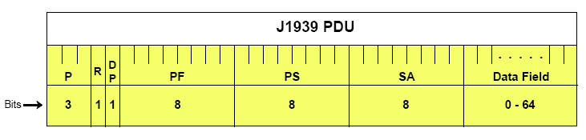
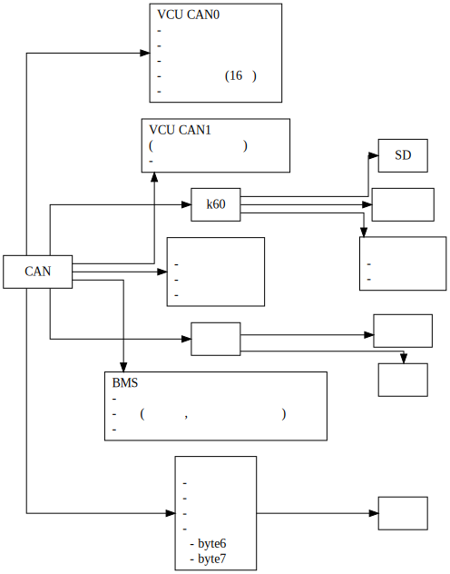

# fury 2019 CAN协议

## 协议规范

- CAN总线系统遵循**CAN2.0B技术规范**

- **物理层**应符合**SAE J1939-11:2006**中的相关规定:
  - 总线通信速率**250kbit/s**

  - 使用CAN扩展帧**29位**标识符

- **格式定义**应符合**SAE J1939-21:2006**中的相关规定:

  - 多字节数据发送时, **低字节先发, 高字节后发**

  - 29位标识符由**优先级P** (0~7), **保留位R** (=0), **数据页DP** (=0), **PDU格式PF**, **PDU特定格式PS**及**源地址SA**七部分组成.

  - SAE J1939-21规范定义了两种PDU格式: **PDU1** (PS为目标地址), **PDU2** (PS为组扩展). PDU2格式用于不指向特定目标地址的传输. **本规范选用PDU2格式**.

  - 协议数据单元 (帧) 格式如下:

    

💡 对SAE J1939的解读的参考资料: [商用车控制系统局域网络 (CAN总线) 通信协议](http://cache.amobbs.com/bbs_upload782111/files_42/ourdev_657294Z82YE6.pdf)

## CAN总线网络组成

TODO

## CAN总线各节点地址分配

|CAN网名|节点名称|节点名称缩写|地址分配 (Dec)|地址分配 (Hex)|
|--|---|-|-|--|
|CAN0|整车控制器|VCU|33|0x21|
||电机控制单元|MCU|239|0xEF|
||仪表单元|Meter|23|0x17|
||DC/AC|DCAC|127|0x7F|
||DC/DC|DCDC|126|0x7E|
|CAN4|||||

## 数据格式定义

TODO

## 设备通信协议汇总

